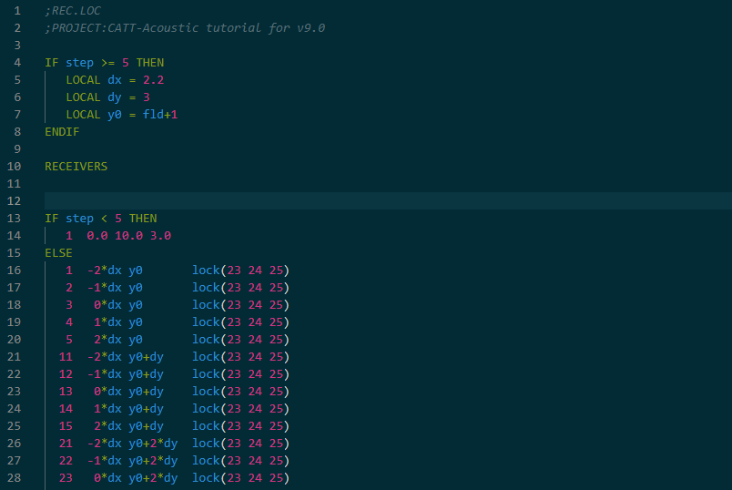
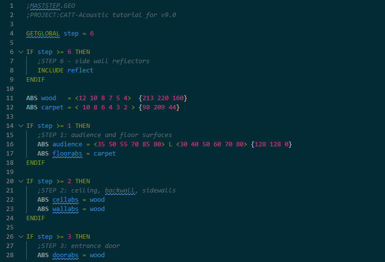
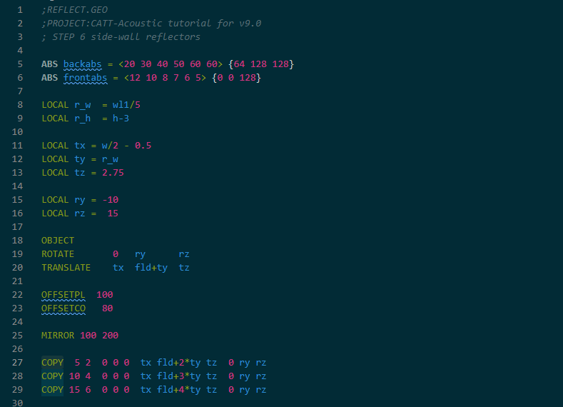
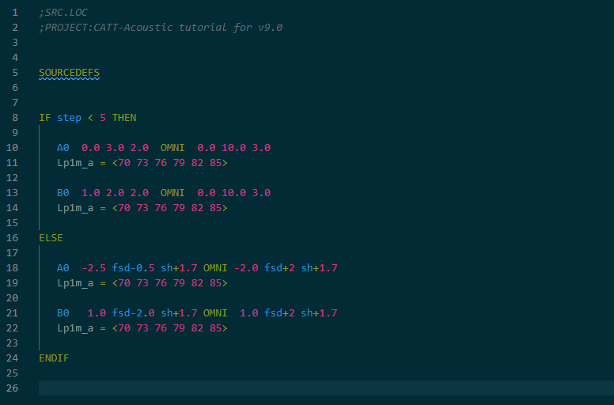
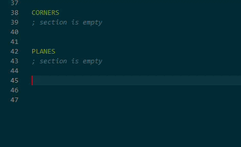
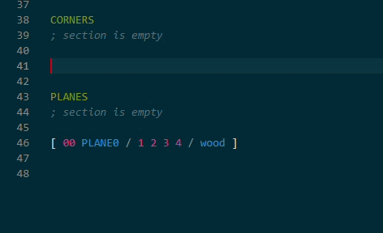
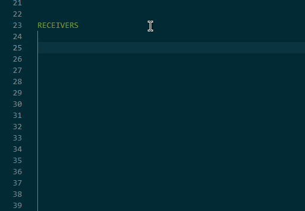
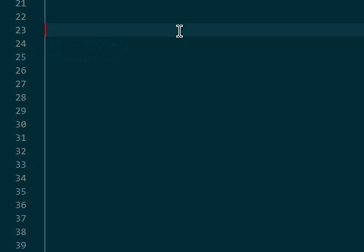

# CATT-Acoustic - VS Code Extension

Syntax highlighting and language support for **CATT-Acoustic** simulation software.

This extension provides support for:

* **`.geo` files** — Geometry definitions (CORNERS, PLANES, MARKERS)
* **`.loc` files** — Source and receiver definitions (SRC.LOC, REC.LOC)

<table>
  <tr>
    <td></td>
    <td></td>
  </tr>
</table>

<table>
  <tr>
    <td></td>
    <td></td>
  </tr>
</table>

## Features

### Syntax Highlighting

* Full support for CATT-Acoustic geometry and location formats
* Highlighting for:

  * materials (`ABS`, `AUDABS`)
  * geometry sections (`CORNERS`, `PLANES`, `MARKERS`)
  * source definitions (`SOURCE`, `SOURCEDEFS`)
  * directives (`LOCAL`, `GLOBAL`, `INCLUDE`, etc.)
* Mathematical functions (`sin`, `cos`, `sqrt`, etc.)
* Variables and expressions
* Control structures (`IF`, `THEN`, `ELSE`)
* Comments (`;`)
* Bracket matching and auto-closing

## Snippets

The extension includes predefined snippets to speed up writing `.geo` and `.loc` files.

### Geometry (`.geo`)

| Prefix    | Description                |
| --------- | -------------------------- |
| `ABS`     | Define material absorption |
| `PLANE`   | Create a plane definition  |
| `CORNER`  | Add a corner point         |

<table>
  <tr>
    <td></td>
    <td></td>
  </tr>
</table>

### Locations (`.loc`)

| Prefix       | Description                |
| ------------ | -------------------------- |
| `SOURCE`     | Create SOURCE block        |
| `RECEIVER`   | Add receiver point         |

<table>
  <tr>
    <td></td>
    <td></td>
  </tr>
</table>

## Supported Directives

### Common (.GEO and .LOC)

* `LOCAL`, `GLOBAL`
* `SCALE`
* `INCLUDE`, `#I`
* `IF`, `THEN`, `ELSE`

### Geometry (.GEO)

* `CORNERS`
* `PLANES`
* `MARKERS`
* `ABS`, `AUDABS`
* `OBJECT`, `ROTATE`, `TRANSLATE`, `SHIFT`

### Locations (.LOC)

* `SOURCE`, `SOURCEDEFS`
* `RECEIVERS`
* `AIMPOS`, `AIMANGLES`, `POS`
* `GAIN`, `LvIn`
* `recloop`, `recline`, `recwalk`

## Contribution

Contributions are welcome.

## For More Information

* [https://www.catt.se/](https://www.catt.se/)
* [https://code.visualstudio.com/api/](https://code.visualstudio.com/api/)

